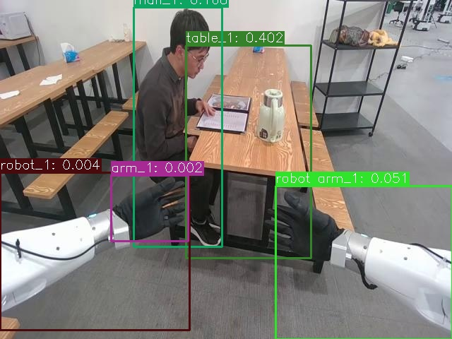
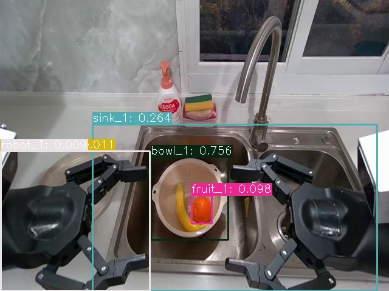
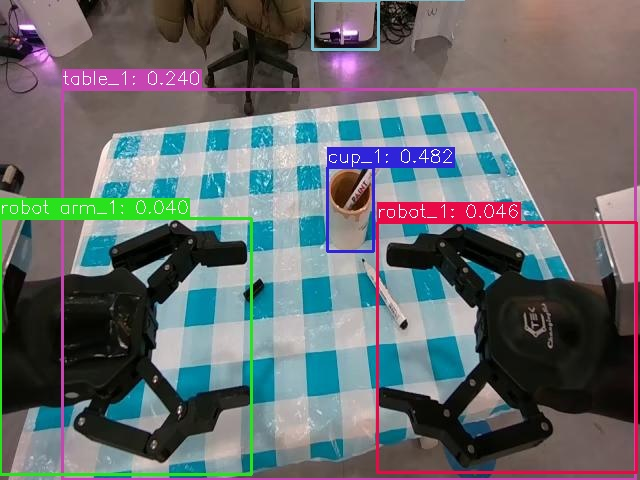
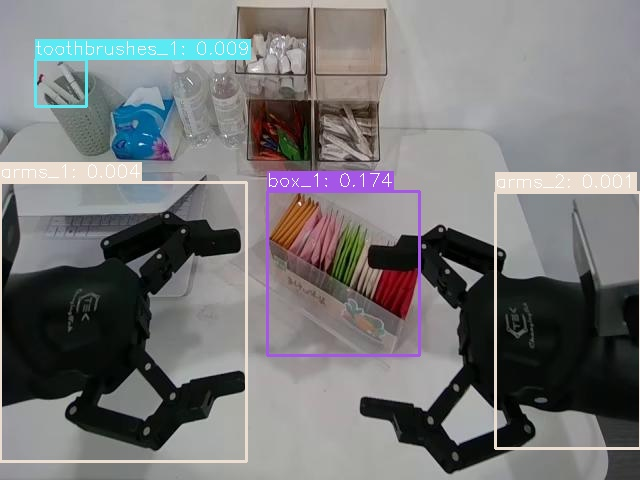
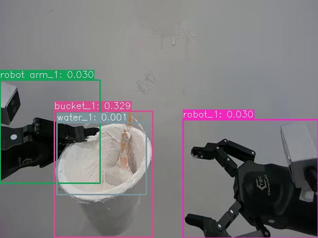
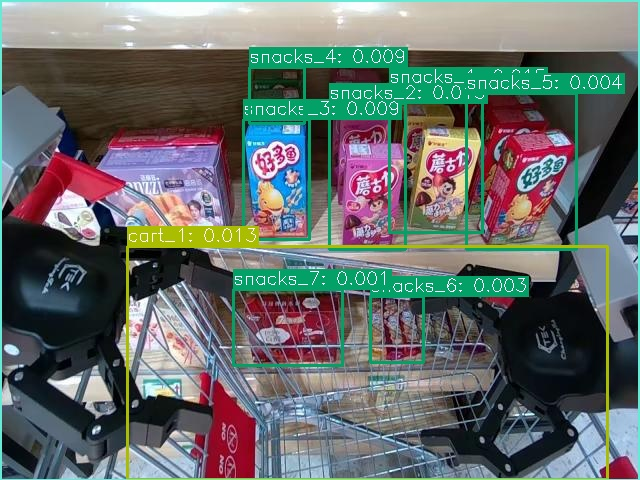

# 🖼️ Automatic Image Annotation ML Pipeline


[](https://colab.research.google.com/drive/1-wrMAGPhDLT5Y0x9i1x62JAOOh6RmBss?authuser=1#scrollTo=NDMT80Q7VKG5)


## 📖 Описание проекта
Автоматизированный пайплайн для генерации аннотаций изображений с использованием **zero-shot** и **мультимодальных моделей**.  
Детекция объектов без предварительного обучения + генерация метаданных (цвет, размер, пространственные отношения) обнаруженных объектов в формате json.

---

## 🚀 Основные возможности

* 🆓 Zero-shot детекция любых объектов, упомянутых в тексте описания.
* 📝 Генерация описаний и определение цвета каждого объекта.
* 📏 Классификация размера (small, medium, large) по площади bbox.
* 📐 Пространственные отношения между объектами (above, below, left of и т.д.).
* 🔄 Гибкие эвристики: объединение пересекающихся боксов, фильтрация по confidence, учёт количества объектов.
---

## 🤖 Особенности
- **Мультимодельный подход**: YOLO-World + BLIP-2 + SAM
- **Автоматизация**: Полный цикл от изображения до JSON-аннотации
- **Поддержка**: Работа с любыми классами объектов

---
## 🛠️ Архитектура пайплайна

---

## 🖥️ Стек технологий

Проект использует следующие основные технологии и библиотеки:
* Язык и среда: Python 3.8+
* Генерация описаний: BLIP-2 (Salesforce/blip2-opt-2.7b)
* Детекция объектов: YOLO-world (YOLOv8), альтернативно OWL-ViT, SAM
* Библиотеки для детекции и трекинга: Ultralytics YOLOv8, Detectron2, torchvision
* Обработка изображений: OpenCV, Pillow
* Научные вычисления: NumPy, SciPy
* Работа с данными: pandas
* Метрики и валидация: scikit-learn, pycocotools

---

## 🎨 Примеры результатов

Ниже два примера работы пайплайна: изображение с пронумерованными объектами и соответствующий JSON-вывод.

### Результат 1 🖼️



<details>
<summary>Показать JSON для Результата 1</summary>

```json
{
    "image_name": "577_820398.jpg",
    "description": "a man sitting at a table with a robot arm\nObject relations:\nAbove relations: man_1 is above arm_1\nRight of relations: table_1 is right of man_1, robot arm_1 is right of arm_1, robot arm_1 is right of robot_1\nAbove-left of relations: man_1 is above-left of robot arm_1, table_1 is above-left of robot arm_1\nAbove-right of relations: table_1 is above-right of arm_1, table_1 is above-right of robot_1, man_1 is above-right of robot_1\nBelow-left of relations: robot_1 is below-left of arm_1",
    "objects": [
      {
        "name": "table_1",
        "color": "black",
        "size": "large: 177x301 (area=53277)",
        "description": "black table cloths and chairs in a restaurant"
      },
      {
        "name": "man_1",
        "color": "red",
        "size": "large: 125x339 (area=42375)",
        "description": "red man wearing gloves and a mask is sitting at a desk"
      },
      {
        "name": "robot arm_1",
        "color": "white",
        "size": "large: 250x217 (area=54250)",
        "description": "white robot arm with gloves on it in front of a table"
      },
      {
        "name": "robot_1",
        "color": "blue",
        "size": "large: 268x223 (area=59764)",
        "description": "blue robot arm is a new way to help people with disabilities"
      },
      {
        "name": "arm_1",
        "color": "black",
        "size": "medium: 109x93 (area=10137)",
        "description": "black arm with gloves on and a metal object"
      }
    ],
    "2d_bbox": [
      {
        "object": "table_1",
        "bbox": [
          263,
          64,
          440,
          365
        ]
      },
      {
        "object": "man_1",
        "bbox": [
          189,
          10,
          314,
          349
        ]
      },
      {
        "object": "robot arm_1",
        "bbox": [
          390,
          263,
          640,
          480
        ]
      },
      {
        "object": "robot_1",
        "bbox": [
          0,
          244,
          268,
          467
        ]
      },
      {
        "object": "arm_1",
        "bbox": [
          157,
          248,
          266,
          341
        ]
      }
    ]
  }
```
</details>

### Результат 2 🖼️



<details>
<summary>Показать JSON для Результата 2</summary>
    
```json
{
    "image_name": "593_805735.jpg",
    "description": "a robot is holding a bowl of fruit in a sink\nObject relations:\nLeft of relations: bowl_1 is left of sink_1, robot arm_1 is left of robot_1\nRight of relations: sink_1 is right of robot_1, fruit_1 is right of robot_1, sink_1 is right of robot arm_1, fruit_1 is right of robot arm_1, bowl_1 is right of robot arm_1, sink_1 is right of fruit_1, bowl_1 is right of robot_1\nAbove-left of relations: bowl_1 is above-left of fruit_1",
    "objects": [
      {
        "name": "bowl_1",
        "color": "orange",
        "size": "medium: 127x136 (area=17272)",
        "description": "orange bowl in sink"
      },
      {
        "name": "sink_1",
        "color": "orange",
        "size": "large: 468x274 (area=128232)",
        "description": "orange sink with a bowl of fruit in it"
      },
      {
        "name": "fruit_1",
        "color": "orange",
        "size": "small: 33x46 (area=1518)",
        "description": "orange fruit in a bowl with a banana and a banana peel"
      },
      {
        "name": "robot arm_1",
        "color": "black",
        "size": "large: 246x231 (area=56826)",
        "description": "black robot arm holding a cup of coffee"
      },
      {
        "name": "robot_1",
        "color": "black",
        "size": "large: 245x230 (area=56350)",
        "description": "black robot arm holding a cup of coffee"
      }
    ],
    "2d_bbox": [
      {
        "object": "bowl_1",
        "bbox": [
          248,
          259,
          375,
          395
        ]
      },
      {
        "object": "sink_1",
        "bbox": [
          152,
          205,
          620,
          479
        ]
      },
      {
        "object": "fruit_1",
        "bbox": [
          315,
          322,
          348,
          368
        ]
      },
      {
        "object": "robot arm_1",
        "bbox": [
          0,
          249,
          246,
          480
        ]
      },
      {
        "object": "robot_1",
        "bbox": [
          1,
          249,
          246,
          479
        ]
      }
    ]
  }
```
</details>

### Результат 3 🖼️



<details>
<summary>Показать JSON для Результата 3</summary>
    
```json
{
    "image_name": "613_838783.jpg",
    "description": "a robot arm is holding a cup of coffee on a table\nObject relations:\nAbove relations: cup_1 is above table_1\nBelow relations: cup_1 is below coffee_1, table_1 is below coffee_1\nLeft of relations: table_1 is left of robot_1\nRight of relations: robot_1 is right of robot arm_1, table_1 is right of robot arm_1\nAbove-left of relations: cup_1 is above-left of robot_1\nAbove-right of relations: cup_1 is above-right of robot arm_1\nBelow-left of relations: robot arm_1 is below-left of coffee_1\nBelow-right of relations: robot_1 is below-right of coffee_1",
    "objects": [
      {
        "name": "cup_1",
        "color": "brown",
        "size": "medium: 46x84 (area=3864)",
        "description": "brown cup with a pen in it on a blue tablecloth"
      },
      {
        "name": "table_1",
        "color": "blue",
        "size": "large: 573x390 (area=223470)",
        "description": "blue table cloth with a white checkered table cloth"
      },
      {
        "name": "robot_1",
        "color": "blue",
        "size": "large: 259x250 (area=64750)",
        "description": "blue robot arm with a knife and a knife"
      },
      {
        "name": "robot arm_1",
        "color": "blue",
        "size": "large: 251x256 (area=64256)",
        "description": "blue robot arm on a table with a knife and fork"
      },
      {
        "name": "coffee_1",
        "color": "purple",
        "size": "medium: 66x49 (area=3234)",
        "description": "purple coffee machine in the kitchen"
      }
    ],
    "2d_bbox": [
      {
        "object": "cup_1",
        "bbox": [
          327,
          167,
          373,
          251
        ]
      },
      {
        "object": "table_1",
        "bbox": [
          62,
          89,
          635,
          479
        ]
      },
      {
        "object": "robot_1",
        "bbox": [
          377,
          222,
          636,
          472
        ]
      },
      {
        "object": "robot arm_1",
        "bbox": [
          0,
          218,
          251,
          474
        ]
      },
      {
        "object": "coffee_1",
        "bbox": [
          312,
          0,
          378,
          49
        ]
      }
    ]
  }
```
</details>

### Результат 4 🖼️



<details>
<summary>Показать JSON для Результата 4</summary>
    
```json
{
    "image_name": "698_860913.jpg",
    "description": "two robotic arms are on a table with a box of toothbrushes\nObject relations:\nAbove relations: toothbrushes_1 is above arms_1\nLeft of relations: box_1 is left of arms_2, arms_1 is left of arms_2\nRight of relations: box_1 is right of arms_1\nAbove-left of relations: toothbrushes_1 is above-left of arms_2\nBelow-right of relations: box_1 is below-right of toothbrushes_1",
    "objects": [
      {
        "name": "box_1",
        "color": "",
        "size": "medium: 152x164 (area=24928)",
        "description": "box of tea bags in a clear box"
      },
      {
        "name": "toothbrushes_1",
        "color": "white",
        "size": "small: 51x47 (area=2397)",
        "description": "white toothbrushes in a white bowl"
      },
      {
        "name": "arms_1",
        "color": "black",
        "size": "large: 246x279 (area=68634)",
        "description": "black arms with two small metal pieces attached to them"
      },
      {
        "name": "arms_2",
        "color": "black",
        "size": "large: 145x256 (area=37120)",
        "description": "black arms and a black motorcycle on display"
      }
    ],
    "2d_bbox": [
      {
        "object": "box_1",
        "bbox": [
          267,
          191,
          419,
          355
        ]
      },
      {
        "object": "toothbrushes_1",
        "bbox": [
          35,
          59,
          86,
          106
        ]
      },
      {
        "object": "arms_1",
        "bbox": [
          0,
          182,
          246,
          461
        ]
      },
      {
        "object": "arms_2",
        "bbox": [
          495,
          192,
          640,
          448
        ]
      }
    ]
  }
```
</details>

### Результат 5 🖼️



<details>
<summary>Показать JSON для Результата 5</summary>
    
```json
{
    "image_name": "762_907671.jpg",
    "description": "a robot arm holding a bucket of water\nObject relations:\nBelow relations: bucket_1 is below water_1\nLeft of relations: bucket_1 is left of robot_1, robot arm_1 is left of robot_1\nRight of relations: robot_1 is right of water_1\nAbove-left of relations: robot arm_1 is above-left of water_1\nBelow-right of relations: bucket_1 is below-right of robot arm_1",
    "objects": [
      {
        "name": "bucket_1",
        "color": "white",
        "size": "large: 198x254 (area=50292)",
        "description": "white bucket with a plastic bag and a plastic brush"
      },
      {
        "name": "robot arm_1",
        "color": "white",
        "size": "large: 201x208 (area=41808)",
        "description": "white robot arm holding a white cake"
      },
      {
        "name": "robot_1",
        "color": "black",
        "size": "large: 272x239 (area=65008)",
        "description": "black robot arm with two hands attached to it"
      },
      {
        "name": "water_1",
        "color": "white",
        "size": "medium: 180x145 (area=26100)",
        "description": "white water in a bucket with a brush"
      }
    ],
    "2d_bbox": [
      {
        "object": "bucket_1",
        "bbox": [
          109,
          224,
          307,
          478
        ]
      },
      {
        "object": "robot arm_1",
        "bbox": [
          0,
          161,
          201,
          369
        ]
      },
      {
        "object": "robot_1",
        "bbox": [
          368,
          241,
          640,
          480
        ]
      },
      {
        "object": "water_1",
        "bbox": [
          114,
          247,
          294,
          392
        ]
      }
    ]
  }
```
</details>

### Результат 6 🖼️



<details>
<summary>Показать JSON для Результата 6</summary>
    
```json
{
    "image_name": "354_652724.jpg",
    "description": "a shopping cart with a cart full of snacks\nObject relations:\nAbove relations: snacks_1 is above snacks_6, snacks_3 is above snacks_7, snacks_1 is above cart_1, snacks_4 is above snacks_7, snacks_2 is above snacks_6, snacks_4 is above cart_1, snacks_4 is above shopping_1, snacks_2 is above cart_1\nBelow relations: snacks_3 is below snacks_4, snacks_7 is below shopping_1, cart_1 is below shopping_1\nLeft of relations: snacks_4 is left of snacks_5, snacks_2 is left of snacks_5, snacks_1 is left of snacks_5, snacks_3 is left of snacks_5\nRight of relations: snacks_5 is right of shopping_1, snacks_1 is right of snacks_2, snacks_1 is right of snacks_3, snacks_2 is right of snacks_3, snacks_6 is right of snacks_7, snacks_1 is right of snacks_4\nAbove-left of relations: snacks_3 is above-left of cart_1, snacks_3 is above-left of shopping_1, snacks_3 is above-left of snacks_6, snacks_7 is above-left of cart_1, snacks_4 is above-left of snacks_6\nAbove-right of relations: snacks_1 is above-right of snacks_7, snacks_5 is above-right of snacks_6, snacks_2 is above-right of snacks_7, snacks_5 is above-right of snacks_7, snacks_2 is above-right of shopping_1, snacks_5 is above-right of cart_1, snacks_1 is above-right of shopping_1, snacks_6 is above-right of cart_1\nBelow-right of relations: snacks_2 is below-right of snacks_4, snacks_6 is below-right of shopping_1",
    "objects": [
      {
        "name": "snacks_1",
        "color": "red",
        "size": "medium: 93x145 (area=13485)",
        "description": "red snacks are displayed in a store"
      },
      {
        "name": "snacks_2",
        "color": "pink",
        "size": "medium: 76x146 (area=11096)",
        "description": "pink snacks are displayed in a store"
      },
      {
        "name": "snacks_3",
        "color": "blue",
        "size": "medium: 66x120 (area=7920)",
        "description": "blue snacks in chinese packaging"
      },
      {
        "name": "snacks_4",
        "color": "green",
        "size": "medium: 55x56 (area=3080)",
        "description": "green snacks with chinese writing on them"
      },
      {
        "name": "snacks_5",
        "color": "red",
        "size": "medium: 110x156 (area=17160)",
        "description": "red snacks are displayed on a shelf in a store"
      },
      {
        "name": "snacks_6",
        "color": "red",
        "size": "medium: 53x66 (area=3498)",
        "description": "red snacks in a grocery store"
      },
      {
        "name": "snacks_7",
        "color": "red",
        "size": "medium: 109x76 (area=8284)",
        "description": "red snacks in a shopping cart"
      },
      {
        "name": "cart_1",
        "color": "red",
        "size": "large: 480x233 (area=111840)",
        "description": "red cart in a supermarket"
      },
      {
        "name": "shopping_1",
        "color": "red",
        "size": "large: 639x480 (area=306720)",
        "description": "red shopping cart with a child's toy on top"
      }
    ],
    "2d_bbox": [
      {
        "object": "snacks_1",
        "bbox": [
          389,
          87,
          482,
          232
        ]
      },
      {
        "object": "snacks_2",
        "bbox": [
          329,
          103,
          405,
          249
        ]
      },
      {
        "object": "snacks_3",
        "bbox": [
          243,
          119,
          309,
          239
        ]
      },
      {
        "object": "snacks_4",
        "bbox": [
          249,
          67,
          304,
          123
        ]
      },
      {
        "object": "snacks_5",
        "bbox": [
          466,
          93,
          576,
          249
        ]
      },
      {
        "object": "snacks_6",
        "bbox": [
          370,
          296,
          423,
          362
        ]
      },
      {
        "object": "snacks_7",
        "bbox": [
          233,
          289,
          342,
          365
        ]
      },
      {
        "object": "cart_1",
        "bbox": [
          127,
          246,
          607,
          479
        ]
      },
      {
        "object": "shopping_1",
        "bbox": [
          0,
          0,
          639,
          480
        ]
      }
    ]
  }
```
</details>
